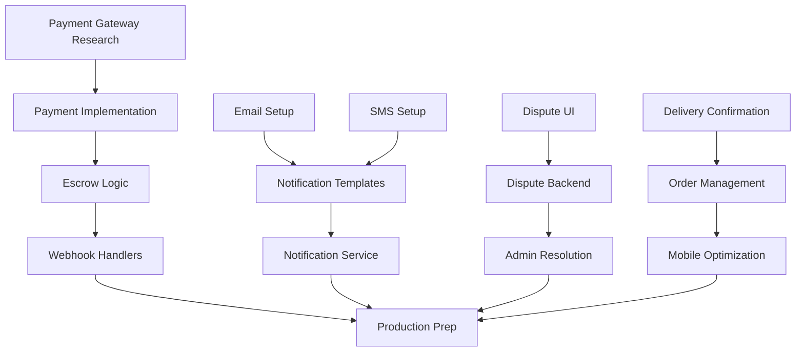

# Phase 1.5: MVP Completion - Task Breakdown

**Target Dates**: January 15-30, 2025
**Goal**: Complete all critical MVP features for production launch
**Team Size**: 1-2 developers

---

## Week 1: Payment & Notifications (Jan 15-22)

### Day 1-3: Payment Gateway Research & Setup

#### Research Tasks (Day 1)
- [ ] Research Jordan-specific payment gateways:
  - [ ] HyperPay API documentation review
  - [ ] PayTabs capabilities assessment
  - [ ] ClickPay (formerly PayTabs) evaluation
  - [ ] Compare fees, features, and integration complexity
- [ ] Decision matrix for PSP selection
- [ ] Account setup with chosen provider
- [ ] Obtain sandbox credentials

#### Implementation Planning (Day 2)
- [ ] Design payment provider interface (`IPaymentProvider`)
- [ ] Plan database schema for payment methods
- [ ] Create payment flow diagrams
- [ ] Security requirements checklist

#### Initial Integration (Day 3)
- [ ] Create payment provider implementation
- [ ] Implement tokenization endpoint
- [ ] Add payment method storage (encrypted)
- [ ] Create payment intent creation

### Day 4-5: Escrow Implementation

#### Escrow Logic (Day 4)
- [ ] Implement payment hold mechanism
- [ ] Create escrow release function
- [ ] Add partial release capability
- [ ] Implement refund processing
- [ ] Add commission calculation

#### Webhook Handlers (Day 5)
- [ ] Payment success webhook
- [ ] Payment failure webhook
- [ ] Refund webhook
- [ ] Dispute webhook (from PSP)
- [ ] Webhook signature validation

### Day 6-7: Notification System

#### Email Setup (Day 6)
- [ ] SendGrid/Resend account setup
- [ ] Email template engine setup
- [ ] Create base email templates:
  - [ ] Order confirmation
  - [ ] Order status update
  - [ ] Delivery notification
  - [ ] Payment confirmation
  - [ ] Dispute alert
- [ ] Email sending service
- [ ] Email queue implementation

#### SMS Integration (Day 7)
- [ ] Twilio account setup for Jordan
- [ ] SMS template creation (Arabic/English)
- [ ] SMS sending service
- [ ] Delivery PIN via SMS
- [ ] Critical alerts via SMS
- [ ] SMS delivery tracking

---

## Week 2: User Experience & Production (Jan 23-30)

### Day 8-9: Dispute Management

#### Contractor Side (Day 8)
- [ ] "Report Issue" button in order details
- [ ] Dispute reason selection:
  - [ ] Wrong items delivered
  - [ ] Damaged goods
  - [ ] Quantity mismatch
  - [ ] Quality issues
  - [ ] Non-delivery
  - [ ] Other (with description)
- [ ] Evidence upload component:
  - [ ] Photo upload (multiple)
  - [ ] Document upload
  - [ ] Description field
- [ ] Dispute submission flow

#### Admin & Resolution (Day 9)
- [ ] Dispute listing in admin panel
- [ ] Dispute detail view
- [ ] Evidence viewer
- [ ] Communication thread
- [ ] Resolution actions:
  - [ ] Full refund
  - [ ] Partial refund
  - [ ] Replace items
  - [ ] Reject dispute
- [ ] Auto-escalation for ≥350 JOD
- [ ] Site visit scheduling

### Day 10-11: Contractor Experience

#### Delivery Confirmation (Day 10)
- [ ] Delivery confirmation page
- [ ] Accept delivery flow:
  - [ ] PIN entry for ≥120 JOD
  - [ ] Photo requirement for <120 JOD
  - [ ] Signature capture (optional)
- [ ] Quick accept button
- [ ] Partial delivery handling
- [ ] Immediate dispute option

#### Order Management (Day 11)
- [ ] Order history improvements:
  - [ ] Status filters
  - [ ] Date range filter
  - [ ] Search by order number
  - [ ] Sort options
- [ ] Order detail enhancements:
  - [ ] Status timeline
  - [ ] Delivery tracking
  - [ ] Communication history
- [ ] Invoice download (PDF)
- [ ] Reorder functionality

### Day 12: Mobile Optimization

- [ ] Responsive design audit
- [ ] Touch-friendly buttons (min 44px)
- [ ] Mobile navigation improvements
- [ ] Swipe gestures for order cards
- [ ] Image optimization for mobile
- [ ] Performance testing on 3G/4G
- [ ] Cross-device testing:
  - [ ] iOS Safari
  - [ ] Android Chrome
  - [ ] Tablets

### Day 13-14: Production Preparation

#### Security & Performance (Day 13)
- [ ] Security audit checklist:
  - [ ] SQL injection tests
  - [ ] XSS vulnerability scan
  - [ ] CSRF protection verify
  - [ ] Rate limiting check
  - [ ] Input validation review
- [ ] Performance testing:
  - [ ] Load testing (100 concurrent users)
  - [ ] Database query optimization
  - [ ] API response time check
  - [ ] Frontend bundle size

#### Deployment & Monitoring (Day 14)
- [ ] Production environment setup:
  - [ ] Environment variables
  - [ ] Secrets management
  - [ ] Domain configuration
  - [ ] SSL certificates
- [ ] Monitoring setup:
  - [ ] Error tracking (Sentry)
  - [ ] Performance monitoring
  - [ ] Uptime monitoring
  - [ ] Log aggregation
- [ ] Backup strategy:
  - [ ] Database backups
  - [ ] Media storage backups
  - [ ] Backup restoration test

---

## Task Dependencies



---

## Definition of Done

### Code Quality
- [ ] TypeScript strict mode passing
- [ ] No ESLint errors
- [ ] Unit tests for critical functions
- [ ] API endpoint tests
- [ ] Code review completed

### Documentation
- [ ] API documentation updated
- [ ] Database schema documented
- [ ] Deployment guide updated
- [ ] User guide for new features

### Testing
- [ ] Manual testing checklist completed
- [ ] Cross-browser testing done
- [ ] Mobile device testing done
- [ ] Payment flow tested (sandbox)
- [ ] Email/SMS delivery verified

### Security
- [ ] Security checklist reviewed
- [ ] Sensitive data encrypted
- [ ] Access controls verified
- [ ] Audit logs implemented

### Performance
- [ ] Page load < 3 seconds
- [ ] API response < 400ms
- [ ] No N+1 queries
- [ ] Images optimized

---

## Risk Mitigation

### High Risk Items
1. **Payment Integration Delays**
   - Mitigation: Start early, have backup PSP option
   - Fallback: Continue with mock provider, integrate later

2. **SMS Delivery Issues**
   - Mitigation: Test with Jordan numbers early
   - Fallback: Email-only notifications initially

3. **Performance Problems**
   - Mitigation: Load test throughout development
   - Fallback: Implement caching, optimize queries

### Medium Risk Items
1. **Mobile Compatibility**
   - Mitigation: Test on real devices regularly
   - Fallback: Focus on critical flows first

2. **Dispute Complexity**
   - Mitigation: Start with simple flow, iterate
   - Fallback: Manual dispute handling initially

---

## Success Criteria

### Functional
- [ ] Can complete full order with real payment
- [ ] Receive all critical notifications
- [ ] Can dispute and resolve orders
- [ ] Mobile users can complete orders

### Non-Functional
- [ ] 99% uptime during testing
- [ ] <3s page load on 4G
- [ ] Zero critical bugs
- [ ] All security tests passing

### Business
- [ ] Ready for pilot with 5 suppliers
- [ ] Can handle 100 orders/day
- [ ] Dispute resolution < 48 hours
- [ ] Payment success rate > 90%

---

## Daily Standup Format

```
1. What was completed yesterday?
2. What's planned for today?
3. Any blockers or risks?
4. Need any clarification?
```

---

## Communication

- **Daily Updates**: GitHub issues
- **Blockers**: Immediate Slack message
- **Decisions**: Document in TECHNICAL_MEMORY.md
- **Progress**: Update this checklist daily

---

## Post-Launch Plan

### Week 1 After Launch
- Monitor error rates
- Gather user feedback
- Fix critical bugs
- Performance optimization

### Week 2 After Launch
- Analyze usage patterns
- Plan Phase 2 priorities
- Start next phase planning
- Celebrate success! 🎉

---

**Note**: This is a living document. Update task status daily and adjust timeline as needed based on actual progress.